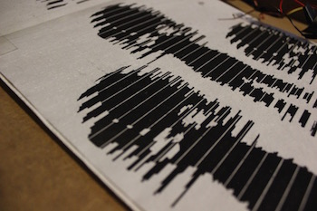
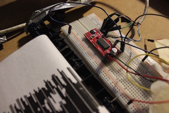
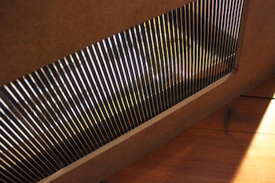

# Keep movin

# conceptual formulation

Our task was to create a motorized Poster or Object witch interacts with the viewer. It has to be created in this way, that there isn´t an active input needed from the person who stands in front of it.
It need to be more like something, which is triggered unconsciously and surprises the viewer. 

# development of concept

I wanted to keep it simple but it still has to confuse the viewer. How is that working? After brainstorming I came to the point that it should be something with an optical illusion. After a long research I was really happy to find the morales effect, which makes a big smile on my face. That was exactly what i was looking for :https://www.youtube.com/watch?v=UW5bcsax78I.

#First protoype

# buildup

+ Box build out of medium density fiberboard
+ transparent sheet printed with the grid( see in Data)
+ ingrain wallpaper printed on the backside with the image of the climbing persons(see in Data)
+ two reels with gear-wheel took from old printers
+ Stepper motor
+ arduino uno
+ cables
+ breadboard
+ motordriver
+ 8V power supply
+ infrared sensor

When the viewer stands in front of the motorposter the infrared sensor send a signal to the arduino. It can be seen as an activator, which makes the code run. The code includes commands which are send to the stepper motor.
The printed wallpaper goes along the two reels in an infinite loop. One of the two reels is connected over the gear wheel with the stepper motor which is controlled by the arduino. The transparent sheet with the black lines on it is fixed behind the gap of the cover of the motorposter.
The printed wallpaper starts to move and the 6 frame animation gets started until the viewer veer away from the object. 

# wiring diagram

# Final result

# Special Thanks

Special thanks to "maerzhase" for your very useful MagicLineAnimationGenerator which makes it possible to built your own 6 frame animation https://github.com/maerzhase/MagicLineAnimationGenerator

  

#Abstract

The idea of my project was to surprise the viewer with the help of an illusion. For this I used the morales effekt (6 frame animation) especially because it works with movement, which is a central topic in the modern society. Everything is getting faster, more precise and effective. The human being always has to work  directly like a machine at it`s best 24 hours a day. The human is in movement every time to follow his aims. The question is if people still have the ability to follow their real dreams and if they run after something with never had existed.

